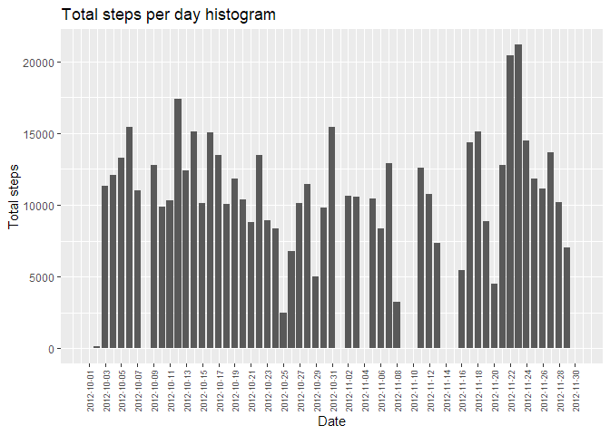
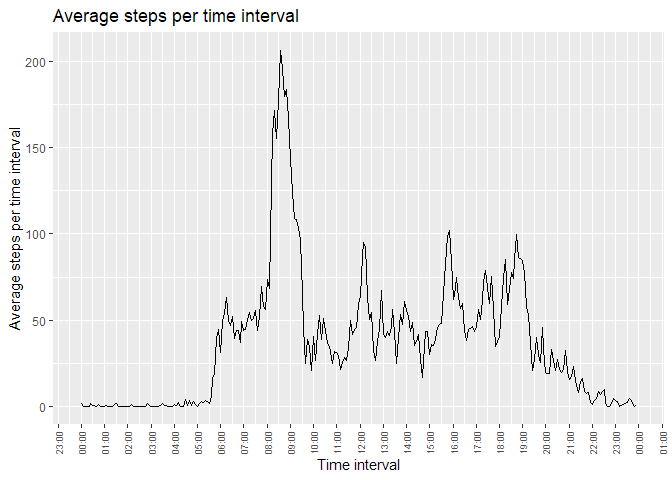
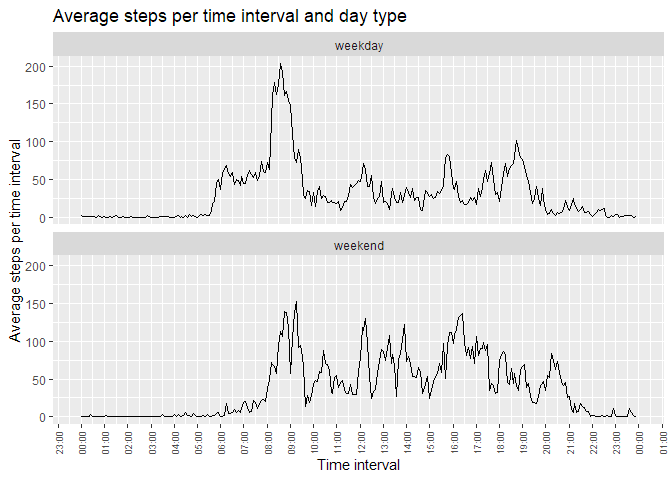

    
#### Author: Hernan Gianini
#### Last update: March 2022  
#   
## Loading and preprocessing the data  

```r
# Load libraries
library(tidyverse)
library(scales)
library(timeDate)
# 1. Read input file
activity <- read.csv("activity.csv",header=TRUE)
# 2. Transform the data
activity <- mutate(activity,time=sprintf("%04d",interval))
activity <- mutate(activity,datetime=strptime(paste0(date,time),"%Y-%m-%d%H%M"))
activity$date <- as.Date(activity$date,"%Y-%m-%d")
activity$time <- paste(substr(activity$time,1,2),substr(activity$time,3,4),sep=":")
activity$time2 <- strptime(activity$time,"%H:%M")
```

#
## What is mean total number of steps taken per day?

```r
totalstepsday <- activity %>% group_by(date) %>% 
    summarize(total=sum(steps,na.rm=TRUE))
with(totalstepsday,
      ggplot(totalstepsday, aes(x=date, y=total)) + 
          geom_bar(stat="identity", width=.8) + 
          labs(title="Total steps per day histogram") + 
          xlab("Date") + ylab("Total steps") + 
          scale_x_date(breaks = date[seq(1, length(date), by = 2)]) + 
          theme(axis.text.x=element_text(angle=90,vjust=0.5,hjust=0.5,size=7))
     )
```

<!-- -->

For the total number of steps taken per day:  
The mean:  

```r
mean(totalstepsday$total,na.rm=TRUE)
```

```
## [1] 9354.23
```
The median:  

```r
median(totalstepsday$total,na.rm=TRUE)
```

```
## [1] 10395
```
  
## What is the average daily activity pattern?  

```r
minintmean <- activity %>% group_by(interval,time2) %>% summarize(intmean = mean(steps,na.rm=TRUE))
ggplot(minintmean,aes(x=as.POSIXct(time2,tz="GMT"),y=intmean)) + 
    geom_line() + 
    xlab("Time interval") + 
    ylab("Average steps per time interval") + 
    labs(title="Average steps per time interval") +
    scale_x_datetime(date_breaks="1 hour",labels= date_format("%H:%M"),timezone="UTC") + 
    theme(axis.text.x=element_text(angle=90,vjust=0.5,hjust=0.5,size=7))
```

<!-- -->
    
5-minute interval, on average across all the days in the dataset, wich contains the maximum number of steps:  

```r
maxsteps <- max(minintmean$intmean)
maxinterval <- minintmean[minintmean$intmean == maxsteps, ]$time2
format(as.POSIXct(maxinterval), format = "%H:%M")
```

```
## [1] "08:35"
```

## Imputing missing values  
1.Total number of missing values in the dataset

```r
sum(is.na(activity$steps))
```

```
## [1] 2304
```
2. Strategy for filling in all of the missing values in the dataset: The mean for that 5-minute interval.  

```r
activity2 <- merge(x=activity,y=minintmean,by="interval")
# Create a new dataset that is equal to the original dataset 
# but with #the missing data filled in.
activity2$steps[is.na(activity2$steps)] <- activity2$intmean
```
3. Histogram of the total number of steps taken each day 

```r
totalstepsday2 <- activity2 %>% group_by(date) %>% 
    summarize(total=sum(steps,na.rm=TRUE))
with(totalstepsday2,
      ggplot(totalstepsday2, aes(x=date, y=total)) + 
          geom_bar(stat="identity", width=.8) + 
          labs(title="Total steps per day histogram") + 
          xlab("Date") + ylab("Total steps") + 
          scale_x_date(breaks = date[seq(1, length(date), by = 2)]) + 
          theme(axis.text.x=element_text(angle=90,vjust=0.5,hjust=0.5,size=7))
     )
```

<!-- -->
4. For the total number of steps taken per day:  
The mean:  

```r
mean(totalstepsday2$total,na.rm=TRUE)
```

```
## [1] 9371.437
```
The median:  

```r
median(totalstepsday2$total,na.rm=TRUE)
```

```
## [1] 10395
```
5. Do these values differ from the estimates from the first part of the assignment?  
The mean of steps of this part (9371.437) is greater than mean of the first part (9354.23), however the medians are the same (10395).  
6. What is the impact of imputing missing data on the estimates of the total daily number of steps?  
So, imputing missing values resulted in an increase in average steps per day.  

## Are there differences in activity patterns between weekdays and weekends?  

```r
# Create factor variable in activity2 dataset
activity2$daytype <- factor(c("weekday","weekend"))
activity2$daytype <- ifelse(isWeekday(activity2$date,wday=1:5),"weekday","weekend")
```
Panel plot containing a time series plot of the 5-minute interval (x-axis) and the average number of steps taken, averaged across all weekday days or weekend days (y-axis).  

```r
minintmean2 <- activity2 %>% group_by(interval,time2.x,daytype) %>% summarize(intmean = mean(steps,na.rm=TRUE))
ggplot(minintmean2,aes(x=as.POSIXct(time2.x,tz="GMT"),y=intmean)) + 
    geom_line() + 
    xlab("Time interval") + 
    ylab("Average steps per time interval") + 
    labs(title="Average steps per time interval and day type") +
    scale_x_datetime(date_breaks="1 hour",labels= date_format("%H:%M"),timezone="UTC") + 
    theme(axis.text.x=element_text(angle=90,vjust=0.5,hjust=0.5,size=7)) +
    facet_wrap(vars(daytype),nrow=2)
```

<!-- -->
  
We can appreciate that the pattern of activity on weekends is more homogeneously distributed than on weekdays.
